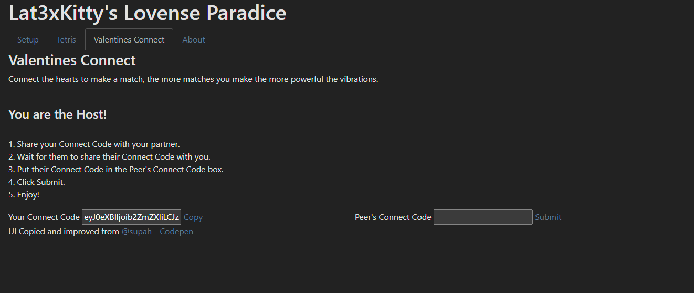
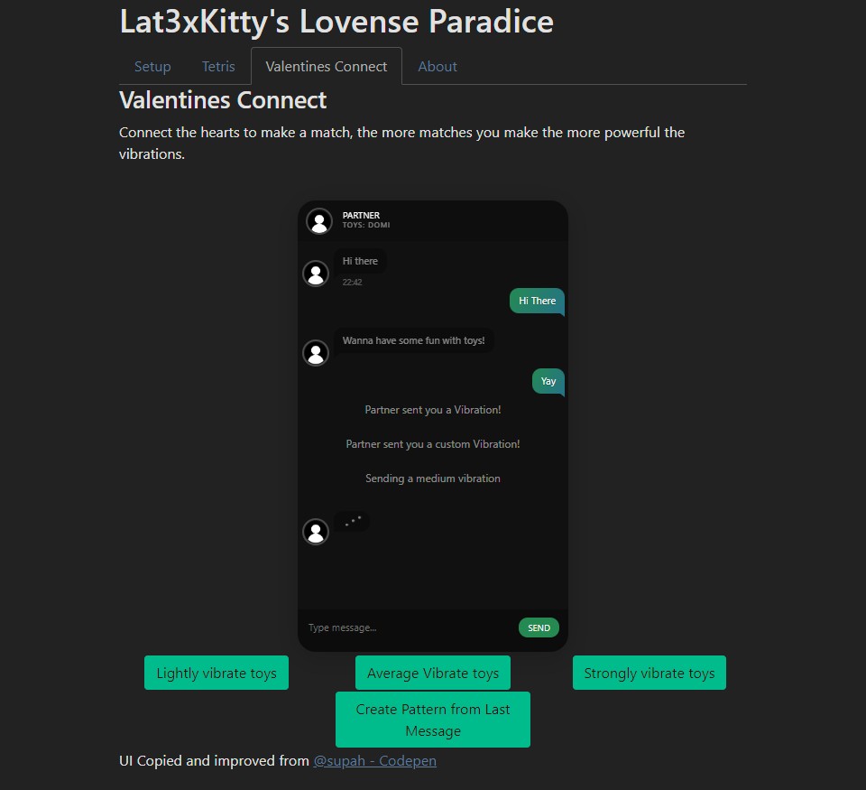

# Lovense's Suite for Lat3xKitty

Intended to be a wide arrange of simle arcade style games like 2048 + Tetris + More but took longer to develop and only got Tetris working.
Enjoy Tetris with a little twist, making you slowly get distracted the further you advance, play in one of two modes

## Setup
Please open Lovense Connect app or Local Desktop App.
 
Load up the page and it should display all the toys which you may want to use (you can use multiple if you want too)
Each Toy should Vibrate to indicate they are active.

And Play ;)

# Tetris

Play a fun simple version of Tetris if you wanna have a bit of fun by yourself.
Enable the Intense mode if you would like to play a bit more of a spicer version.

## Controls
`Left/Right` Arrow Keys / Swipes to move Item. 
`Up` Arrow Key / `Tap` to rotate Item. 
`Space` Key / `Down` Swipe to drop Item. 

PC Only: 
Use `C` to Store the current Item. 
`Down` Arrow Key to lower Item.

# Valentines Connect

Chat with your friends and vibrate their toys as you chat with fun thing. Do simple vibrations or let a pattern be created from your last message in chat 👀
Follow the instructions on screen and make sure you have only 1 Host and 1 Client.

#### Screenshots

#### Video Demonstration
[Example Video (Tetris)](Example_Video.mp4) | [Example Video 2](Example_Video2.mp4)
