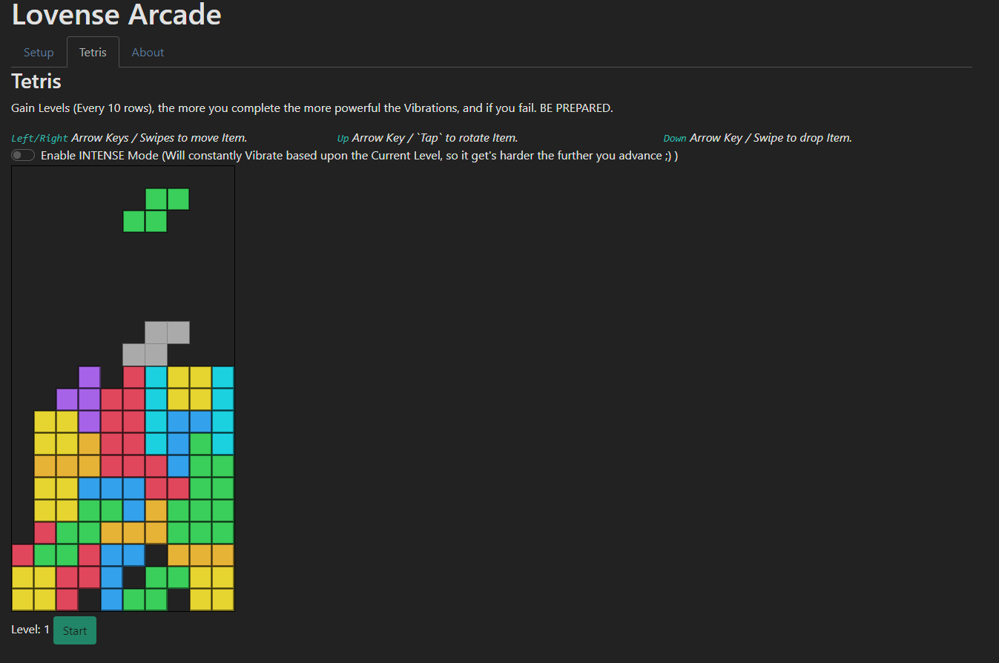

# Lovense Arcade for Lovevense Dev Jam

Intended to be a wide arrange of simle arcade style games like 2048 + Tetris + More but took longer to develop and only got Tetris working.
Enjoy Tetris with a little twist, making you slowly get distracted the further you advance, play in one of two modes

## Setup
Please open Lovense Connect app or Local Desktop App.
 
Load up the page and it should display all the toys which you may want to use (you can use multiple if you want too)
Each Toy should Vibrate to indicate they are active.

And Play ;)

Enable the Intense mode if you would like to play a bit more of a spicer version.

## Play
`Left/Right` Arrow Keys / Swipes to move Item.
`Up` Arrow Key / `Tap` to rotate Item.
`Down` Arrow Key / Swipe to drop Item.

PC Only:
Use `C` to Store the current Item

#### Screenshots

#### Video Demonstration
